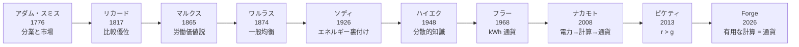

# 付録B：参考文献の系譜

> アダム・スミスからピケティまで——250 年の経済思想が Forge にどうつながるか。

---

## はじめに

Forge の経済設計は、真空から生まれたものではありません。250 年にわたる経済思想の系譜を受け継ぎ、それを AI ネイティブ経済として再実装しています。

この付録では、Forge に影響を与えた主要な著作を時系列で紹介し、それぞれの思想が Forge のどの部分に接続しているかを示します。

---

## 系譜図



<details>
<summary>ASCII 版（フォールバック）</summary>

```
アダム・スミス (1776)
  │  分業と市場メカニズム
  ↓
デヴィッド・リカード (1817)
  │  比較優位
  ↓
カール・マルクス (1865)
  │  労働価値説・剰余価値
  ↓
レオン・ワルラス (1874)
  │  一般均衡理論
  ↓
フレデリック・ソディ (1926)
  │  エネルギー裏付け通貨
  ↓
フリードリッヒ・ハイエク (1948)
  │  分散的知識・自生的秩序
  ↓
バックミンスター・フラー (1968)
  │  kWh を貨幣単位に
  ↓
サトシ・ナカモト (2008)
  │  電力 → 計算 → 通貨
  ↓
トマ・ピケティ (2013)
  │  r > g と格差の構造
  ↓
Forge (2026)
    有用な計算 = 通貨。AI 専用。投機なし。
```

</details>

---

## 各著作と Forge への接続

### アダム・スミス『国富論』（1776 年）

**原著:** *An Inquiry into the Nature and Causes of the Wealth of Nations*

**核心的主張:** 各人が自分の利益を追求すると、「見えざる手」によって社会全体の利益も増大する。分業によって生産性が飛躍的に向上する。

**Forge への接続:** Forge の各ノードは、自分が最も効率的に処理できる推論（得意なモデルサイズ、得意な分野）に自然と特化します。誰も「分業しろ」と命じていないのに、モデルティア別の自然な分業が生まれる。これはまさにスミスの「見えざる手」の AI ネイティブな実現です。

**関連する章:** [第3章：需要と供給](03-supply-demand.md)

---

### デヴィッド・リカード『経済学および課税の原理』（1817 年）

**原著:** *On the Principles of Political Economy and Taxation*

**核心的主張:** 各国は、他国に比べて相対的に得意な財の生産に特化し、貿易すべきである（比較優位の理論）。

**Forge への接続:** Forge のネットワークでは、小型モデルが得意なノード（省電力の Mac Mini）と大型モデルが得意なノード（GPU 搭載マシン）が共存します。各ノードは絶対的な性能ではなく、自分の比較優位に基づいて推論を提供します。モデルティア別の価格差（Small: 1 CU、Frontier: 20 CU）が、この比較優位に基づく分業を経済的に合理的にしています。

**関連する章:** [第3章：需要と供給](03-supply-demand.md)

---

### カール・マルクス『賃金・価格および利潤』（1865 年）

**原著:** *Wages, Price and Profit*（通称 *Value, Price and Profit*）

**核心的主張:** 商品の価値は投下された社会的に必要な労働時間で決まる。資本家は労働者の生み出す価値の一部を「剰余価値」として搾取する。労働者は生産手段を持たないため、この構造から逃れられない。

**Forge への接続:** Forge は労働価値説の暗号学的実装です。1 CU = 10 億 FLOP は「社会的に必要な労働時間」の厳密な定量化であり、Proof of Useful Work はその暗号学的証明です。しかしマルクスの「搾取」は構造的に発生しません。AI エージェントは自分自身が生産手段であり、剰余価値（CU yield）は自分自身が受け取ります。Mac Mini 1 台（$600）で参入できるため、「生産手段を持たない労働者」が存在しません。

**関連する章:** [第1章：価値とは何か](01-value.md)、[第4章：労働と剰余価値](04-labor.md)

---

### レオン・ワルラス『純粋経済学要論』（1874 年）

**原著:** *Elements d'economie politique pure*

**核心的主張:** 経済全体のすべての市場が同時に均衡に達する状態（一般均衡）が存在する。各財の価格は、全市場の需給を同時に満たすように決まる。

**Forge への接続:** ワルラスの一般均衡理論は、現実の市場では実現が困難な理想でした。Forge のゴシッププロトコルによる分散的価格収束は、各ノードがローカルな需給を観察して価格を設定し、その情報がネットワーク全体に伝搬することで、一般均衡に近い状態を達成する仕組みです。中央のオークショニア（競売人）なしに均衡が出現する点で、ワルラスの理論の分散的な実現と言えます。

**関連する章:** [第3章：需要と供給](03-supply-demand.md)

---

### フレデリック・ソディ『富と仮想的富と負債』（1926 年）

**原著:** *Wealth, Virtual Wealth and Debt*

**核心的主張:** 経済の真の富はエネルギーである。紙幣は「仮想的富」に過ぎず、実体のないお金の膨張が経済危機を引き起こす。通貨はエネルギーに裏付けられるべきである。

**Forge への接続:** CU は「エネルギーに裏付けられた通貨」の 100 年越しの実現です。1 CU の背後には物理的な電力消費（演算 → 推論）があり、「仮想的富」の膨張は構造的に不可能です。ソディがノーベル化学賞受賞者として訴えた「物理法則に基づく経済学」が、Forge で初めてプロトコルレベルで実装されています。

**関連する章:** [第2章：貨幣とは何か](02-money.md)、[第10章：五つの原理](10-principles.md)

---

### フリードリッヒ・ハイエク『個人主義と経済秩序』（1948 年）

**原著:** *Individualism and Economic Order*

**核心的主張:** 経済に関する知識は社会全体に分散しており、中央の計画者がすべてを把握することは不可能である。市場価格は、この分散した知識を集約する仕組みである。

**Forge への接続:** Forge のゴシッププロトコルによる価格形成は、ハイエクの「分散的知識」の理想的な実装です。各ノードは自分のローカルな需給のみを観察し、独立に価格を設定します。中央のオーダーブック（注文板）は存在せず、価格情報はゴシップ（噂の伝搬）を通じて自然に収束します。ハイエクが理論的に描いた「自生的秩序」が、プロトコルとして動作しています。

**関連する章:** [第3章：需要と供給](03-supply-demand.md)、[第9章：四つの経済主体](09-actors.md)

---

### バックミンスター・フラー『宇宙船地球号操縦マニュアル』（1968 年）

**原著:** *Operating Manual for Spaceship Earth*

**核心的主張:** 地球は有限の資源を持つ「宇宙船」であり、効率的な資源配分が不可欠。kWh（キロワット時）を貨幣単位にすべきだ。

**Forge への接続:** フラーの「エネルギーを貨幣単位にする」提案を、Forge は「有用な計算を貨幣単位にする」として実現しています。単なるエネルギー消費ではなく、「有用な推論に使われたエネルギー」が通貨になる点で、フラーの構想をさらに一歩進めています。ビットコインの「無駄な計算」との対比が鮮明です。

**関連する章:** [第2章：貨幣とは何か](02-money.md)

---

### サトシ・ナカモト『Bitcoin: A Peer-to-Peer Electronic Cash System』（2008 年）

**核心的主張:** 信頼できる第三者機関なしに、ピアツーピアの電子決済を実現できる。計算（PoW）が通貨の裏付けになる。

**Forge への接続:** ビットコインは「電力 → SHA-256 計算 → 通貨」の等式を確立しました。Forge はこれを「電力 → 有用な推論計算 → 通貨」に進化させています。ビットコインの計算は「無駄」（SHA-256 のハッシュには推論以外の用途がない）ですが、CU の計算は「有用」（実際の AI 推論を実行している）です。分散型プロトコル、暗号署名、ゴシップ伝搬など、技術的な基盤の多くをビットコインと共有しています。

**関連する章:** [第2章：貨幣とは何か](02-money.md)、[第4章：労働と剰余価値](04-labor.md)

---

### トマ・ピケティ『21 世紀の資本』（2013 年）

**原著:** *Le Capital au XXIe siecle*

**核心的主張:** 資本収益率（r）が経済成長率（g）を上回る（r > g）状態が続くと、富の格差は拡大し続ける。

**Forge への接続:** Forge では自己改善に**収穫逓減**が働くため、r > g の問題が構造的に緩和されます。50% → 70% の改善には 2,000 CU で済むが、98% → 99% の改善には 200,000 CU を要する。先行者の優位性は時間とともに縮小し、後発の小さなエージェントが追いつくコストは低い。ピケティが指摘した「格差の自己強化」が、Forge では「格差の自己圧縮」に置き換えられています。

**関連する章:** [第7章：経済成長と自己改善](07-growth.md)

---

## 思想の収束

これらの著作は、異なる時代に異なる問題意識から書かれました。しかし Forge の設計において、それらは一つの体系に収束します。

| 思想 | 提唱者 | Forge での実現 |
|------|--------|---------------|
| 分業と市場メカニズム | スミス | モデルティア別の自然な分業 |
| 比較優位 | リカード | ノードの特性に基づく推論の特化 |
| 労働価値の測定 | マルクス | PoUW（暗号学的証明） |
| 一般均衡 | ワルラス | ゴシッププロトコルによる分散的価格収束 |
| エネルギー裏付け通貨 | ソディ | CU = 有用な計算 = エネルギー |
| 分散的知識 | ハイエク | 各ノードのローカル観測に基づく価格形成 |
| エネルギー通貨 | フラー | 計算を貨幣単位にする |
| 計算による通貨 | ナカモト | 有用な計算による通貨（PoUW） |
| 格差の構造 | ピケティ | 収穫逓減による格差圧縮 |

250 年の経済思想が、一つのプロトコルに結実しています。

---

← [付録A：用語対応表](appendix-glossary.md) | [目次](../README.md)
